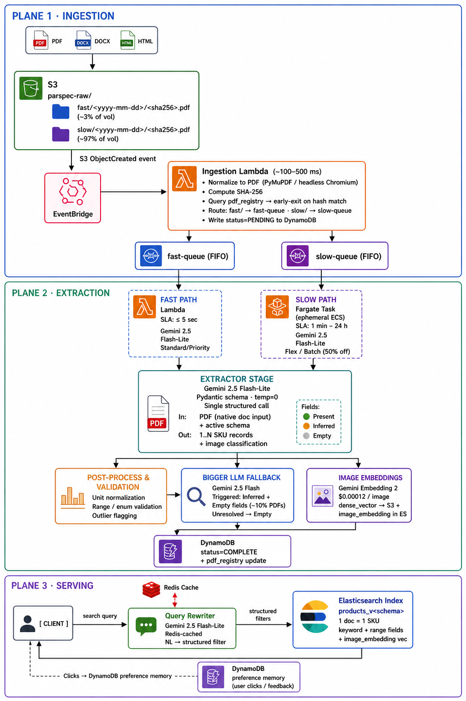
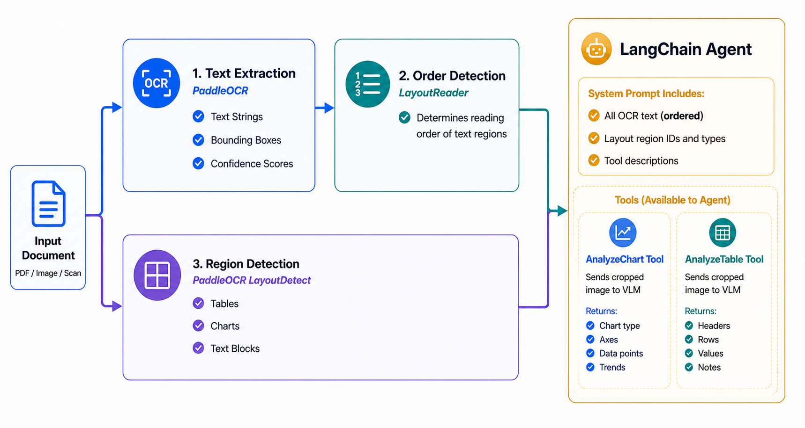

# PDF Extraction Solution

**Structured product attributes from 1.5M non-standardized manufacturer datasheets, refreshed bi-weekly.**
*Architecture · Trade-offs · Unit Economics*

Each PDF is extracted by a VLM in a single structured call against a swappable Pydantic schema. SKU-level records are served via Elasticsearch at a blended ~$0.00105 per processed PDF — comfortably under the $0.002 target. Scope grows from 34 → 600 categories and 10 → 600 attributes as a prompt change, not a pipeline change. Two architectures coexist: **VLM-first** (§1.2) runs today as a single-call extraction; **Hybrid** (§1.3) is staged for migration if VLM economics break, and unlocks parse-once + diff-extract savings precisely because its parse step is non-LLM.

---

# 1. End-to-End Architecture

## 1.1 Architectural Bets

- **VLMs over template parsers.** ~2,000 manufacturers, ~2,000 template families; PyMuPDF silently drops to zero text on scanned PDFs. A general VLM beats per-vendor templates.
- **Single-call structured extraction.** PDF → 1..N SKU records in one Gemini call with Pydantic-structured output.
- **Prompts, not pipelines.** 10 → 600 attributes is a prompt change, not a pipeline change.
- **Reprocess only what changed.** ~300K PDFs every two weeks. Early-exit on content-hash dedup; full re-extract on changed PDFs.
- **SKU-level records.** One PDF ≠ one product. Ordering matrices expand into 1..N SKUs; two SKUs sharing 8 of 10 attributes are variants, not duplicates.
- **Two architectures, one active.** VLM-first (§1.2) today; Hybrid (§1.3) when economics break — selected by cost, not capability. Hybrid additionally persists its deterministic parse output as a canonical artifact and diff-extracts on changes, an optimization that only pays off when the parse step isn't an LLM call.

## 1.2 VLM-First Architecture



### 1.2.1 S3 Layout

| **Bucket** | **Purpose** | **Key Pattern** |
|---|---|---|
| `parspec-raw/fast/` | Fast-path landing zone | `<yyyy-mm-dd>/<sha256>.pdf` |
| `parspec-raw/slow/` | Slow-path landing zone | `<yyyy-mm-dd>/<sha256>.pdf` |
| `parspec-derived/` | Per-schema-version extracted outputs | `v<schema>/<sha256>/products.json` |

### 1.2.2 Two Processing Buckets

Routing is determined entirely by source bucket path — no document classification, no urgency tag. The ingestion Lambda reads the bucket prefix and enqueues to the corresponding SQS queue.

| **Dimension** | **Fast Bucket** | **Slow Bucket** |
|---|---|---|
| Bucket | `s3://parspec-raw/fast/` | `s3://parspec-raw/slow/` |
| Processing need | Result needed immediately | Result can appear on next search |
| Volume | ~3% of total | ~97% of total |
| Gemini tier | Standard/Priority — real-time, guaranteed latency | Flex (1–15 min) or Batch (up to 24 h), 50% off |
| Compute | Lambda (sub-15 min ceiling) | Fargate tasks (no ceiling) |
| Target latency | ≤ 5 sec | 1–15 min (Flex) / up to 24 h (Batch) |
| SQS queue | `parspec-fast-queue` (FIFO) | `parspec-slow-queue` (FIFO) |

### 1.2.3 Ingestion Lambda

Triggered by EventBridge on S3 PUT:

1. **Normalize to PDF.** Input may be DOCX, HTML, or PPTX — convert via PyMuPDF.
2. **Compute SHA-256.** This is the idempotency key for the entire pipeline.
3. **Early-exit on hash collision.** If the hash exists in DynamoDB `pdf_registry`, append the new URL to `source_urls` and return.
4. **Route by source bucket.** `fast/` → `parspec-fast-queue`. `slow/` → `parspec-slow-queue`. No classification, no urgency tag.

Document categorization (lighting/plumbing/HVAC) is handled downstream at extraction via schema-subsetting — not at ingestion.

### 1.2.4 Extractor Stage

Input: PDF on S3 + active attribute schema (Pydantic-serialized). Output: 1..N SKU records validated against the schema, with product images classified within the same call — no separate image classification step.

The PDF is passed directly to Gemini via its [native document understanding feature](https://ai.google.dev/gemini-api/docs/document-processing) — text, images, diagrams, charts, and tables are interpreted in the same call without per-type preprocessing. [Structured output](https://ai.google.dev/gemini-api/docs/structured-output?example=recipe) returns the Pydantic-validated SKU records directly.

Every extracted field carries a provenance label:

- **Present:** Value literally written in the PDF. Indexed directly.
- **Inferred:** Value implied by strong context (e.g., "IP65 rated" → infer Damp + Wet). Bigger LLM invoked with a targeted prompt to resolve uncertain inferences.
- **Empty:** Genuinely absent and not inferable. Bigger LLM invoked to confirm absence and attempt recovery from broader context. If still unresolvable, stored as `Empty` — not a failure.

### 1.2.5 Post-Processing & Validation

| **Check** | **Example Input** | **Normalized Output** |
|---|---|---|
| Decimal locale | 47,2" or 47.2" | 47.2 (inches, float) |
| Fraction → decimal | ⅝", 1-1/2" | 0.625, 1.5 |
| Unit disambiguation | "24V" (ambiguous) | Reject; force AC/DC tag |
| Range vs point | "120-277V" | {min: 120, max: 277, unit: V} |
| CCT validation | 35000K (typo) | Flag as outlier |
| Enum coercion | "rec. mtd." | "Recessed" (synonym map) |
| Multi-value parse | "0-10V, DALI" | ["0-10V", "DALI"] |
| NaN/inf on numeric | NaN from bad extraction | null |
| Label bucketing | "Downlight", "Down Light", "Recessed Downlight" | "Downlight" (manufacturer synonym → canonical bucket) |

Label bucketing applies to any enum-like field where manufacturers use inconsistent terminology — category, mounting type, application, and others. A versioned mapping file (provided externally) defines synonym → canonical-value pairs per field. Post-processing applies the map before indexing.

### 1.2.6 Bigger LLM Fallback

The bigger LLM (Gemini 2.5 Flash — see §3.2 for pricing) is invoked specifically for fields tagged **Inferred** or **Empty** (see §1.2.4) — not as a blanket confidence-threshold fallback. The targeted prompt is scoped to those specific fields. After this pass every field resolves to Present, Inferred, or Empty — `Empty` is a final state, not a failure. No human review sits in the hot path; review is an offline periodic audit.

### 1.2.7 Compute — Lambda for Fast, Fargate for Slow

| **Stage** | **Path** | **Compute** | **Why** |
|---|---|---|---|
| Ingestion: normalize, hash, dedup, route | All traffic | Lambda | Short-lived (~100–500 ms), event-triggered |
| Extract + Post-process | Fast (~3%) | Lambda | Gemini Standard responds in ~3–5 sec, well inside Lambda's 15-min ceiling |
| Extract + Post-process | Slow (~97%) | Fargate task (ephemeral ECS) | Flex up to 15 min; Batch polls up to 24 h — no ceiling needed |
| Fallback model | Any — inline in extraction task | Same Fargate/Lambda task | No separate compute needed |

### 1.2.8 SQS — Burst Buffering and Fault Tolerance

Two FIFO queues (one per path) buffer between ingestion and extraction, providing burst buffering, deduplication (MessageDeduplicationId = SHA-256), path-based routing, fault tolerance, and automatic Flex → Batch failover. SQS holds backlog for up to 14 days.

## 1.3 Hybrid Architecture — Alternate When Economics Break

The architecture above is the active VLM-first pipeline. A second architecture sits ready for migration: **Hybrid**. It is the path forward when VLM-first economics stop working (Gemini reprices, the blended cost target is breached, or Flash-Lite is deprecated). In that case the single VLM extraction call is replaced by a deterministic pre-processing layer that feeds a targeted LangChain agent — calling VLM tools only on layout-detected regions of interest, decoupling token cost from page count. A 50-page catalog with 3 charts and 5 tables incurs VLM cost on 8 crops rather than 50 full pages.



**Stage breakdown:**

| **Stage** | **Component** | **Output** |
|---|---|---|
| Text extraction | PaddleOCR | Text strings, bounding boxes, confidence scores |
| Region detection | PaddleOCR LayoutDetect | Tables, charts, text block boundaries |
| Reading order | LayoutReader | Correct traversal order across multi-column and table regions |
| Markdown assembly | LangChain Agent + VLM tools | Canonical Markdown written to `s3://parspec-canonical/<sha256>/document.md` |
| SKU extraction | Gemini 2.5 Flash-Lite (Pydantic structured output) | 1..N SKU records read off the stored canonical Markdown + active schema; full or diff-mode per §1.3.1 |

**LangChain Agent system prompt receives:**
- All OCR text in LayoutReader-determined reading order
- Layout region IDs and types (table, chart, text block)
- Tool descriptions for `AnalyzeChart` and `AnalyzeTable`

**Agent tools:**

| **Tool** | **Input** | **Returns** |
|---|---|---|
| `AnalyzeChart` | Cropped chart image → VLM | Chart type, axes, data points, trends |
| `AnalyzeTable` | Cropped table image → VLM | Headers, rows, values, notes |

### 1.3.1 Parse Once, Extract Many — Hybrid's Cost Lever

Hybrid's parse layer (PaddleOCR + LayoutReader + VLM tool calls on cropped regions only) is dominated by deterministic, non-LLM compute. Canonical Markdown is therefore cheap to produce and cheap to persist in S3 — which unlocks two optimizations that don't pencil out under VLM-first, where parse and extract are folded into a single Gemini call and no reusable intermediate artifact exists:

- **Parse once.** Markdown is written to `s3://parspec-canonical/<sha256>/document.md` on first encounter and reused thereafter. Re-extracting a new attribute across all 1.5M PDFs runs the schema against the stored Markdown only — skipping the parse stage entirely, which is the dominant cost of a full re-run under VLM-first.
- **Diff-extract on changed PDFs.** ~70% of the 300K bi-weekly changes touch <30% of the document. With Markdown in hand, a `difflib.unified_diff` against the prior version lets the extractor see only changed sections and emit a JSON delta merged into the existing SKU record. Empirically this trims extraction tokens by 70–85% on minor-change PDFs.

```python
import difflib

def compute_section_diff(old_markdown: str, new_markdown: str) -> tuple[str, float]:
    old_lines = old_markdown.splitlines()
    new_lines = new_markdown.splitlines()
    diff = list(difflib.unified_diff(old_lines, new_lines, lineterm=""))
    changed_lines = sum(1 for l in diff if l.startswith(("+", "-")) and not l.startswith(("+++", "---")))
    changed_fraction = changed_lines / max(len(old_lines), 1)
    return "\n".join(diff), changed_fraction

diff_text, changed_fraction = compute_section_diff(old_md, new_md)

if changed_fraction < 0.30:
    delta = llm_extract_delta(diff_text, existing_sku_record)
    updated_sku_record = merge_delta(existing_sku_record, delta)
else:
    updated_sku_record = llm_extract_full(new_md)
```

Diff-extract prompt:

```
You are updating an existing product record. Below are the only sections 
that changed. Update only the affected fields. Return a JSON delta 
containing only the modified fields.

Existing SKU record: <existing_json>
Changed sections: <diff_text>
```

`merge_delta` applies only returned fields; all others retain existing values and provenance. Fields removed in diff → `Empty`; new fields → `Present`/`Inferred`. The diff layer lives entirely within the existing extraction task — no new infrastructure.

### 1.3.2 Tradeoffs and Migration Triggers

Hybrid emits the same Pydantic-validated SKU records as §1.2, so post-processing, the bigger-LLM fallback, and serving (Plane 3) are bit-for-bit unchanged. The tradeoff is operational complexity in Plane 2: a GPU Fargate fleet for PaddleOCR, three additional model dependencies (PaddleOCR, LayoutReader, the LangChain agent), assembly logic to stitch ordered OCR text with agent tool outputs, and a separate extraction LLM call over the stored Markdown — the call that parse-once amortizes across schema changes.

**Migration triggers** (evaluated at weekly ops review):

- Blended cost per PDF exceeds $0.002 for two consecutive cycles
- Gemini 2.5 Flash-Lite deprecation notice issued by Google
- Schema-migration cost (full re-extract on 1.5M PDFs) becomes a recurring planning constraint — Hybrid's stored canonical Markdown lets schema re-runs skip the parse stage, materially cutting the per-migration bill

---

# 2. Search

## 2.1 Query Flow

Query → Query Rewriter (Gemini 2.5 Flash-Lite, Redis-cached): NL → structured filters → Elasticsearch search (top-20) → clicks captured in DynamoDB per-tenant preference memory.

Parspec already operates Elasticsearch. Because the rewriter converts natural language into fully structured filters before Elasticsearch sees the request, ES 8.x keyword and range filters over structured fields deliver accurate, low-latency results at 1.5M-scale. The query rewriter's NL → structured filter conversion, combined with a 600-attribute schema, covers the full query space without semantic text retrieval.

Example: "2-inch aperture downlights with DALI dimming, 3000K, 120V" → structured filters (aperture=2", category=downlight, dimming=DALI, CCT=3000K, voltage=120V).

## 2.2 Image Search

Gemini Embedding 2 is a multimodal embedding model that projects text and images into a shared vector space. It generates embeddings at $0.00012/image, stored as the `image_embedding` dense_vector. This step runs in parallel with post-processing and the bigger LLM fallback — not sequentially after them — reducing overall latency. Supports reverse image search (upload product photo → find matching SKUs).

---

# 3. Unit Economics

## 3.1 Input Assumptions

| **Assumption** | **Value** |
|---|---|
| Total PDF corpus | 1,500,000 |
| New/changed PDFs per cycle (bi-weekly) | 300,000 (20%) |
| Fast-path PDFs (real-time, Lambda + Gemini Standard) | ~3% of total |
| Slow-path PDFs (batch, Fargate + Gemini Flex/Batch) | ~97% of total |
| Avg input tokens per extraction call (3–4 pages incl. 1–2 product images) | ~4,000 |
| Avg output tokens per extraction call (structured JSON, 1..N SKUs) | ~500 |
| Cycles per year | 26 |
| % PDFs triggering bigger LLM fallback (Inferred/Empty fields) | ~10% |
| Slow-path Gemini discount (Flex/Batch) | 50% |

## 3.2 Per-PDF Cost Breakdown

Each line is the **expected cost per processed PDF**: per-occurrence price × per-PDF frequency × path mix (97% slow at 50% Flex/Batch discount + 3% fast at standard pricing). The Bigger LLM row is frequency-weighted at 10% of PDFs; the Extract and Image-embedding rows fire on every processed PDF.

**Per-occurrence pricing**

| **Component** | **Pricing** |
|---|---|
| Gemini 2.5 Flash-Lite | $0.10 / $0.40 per MTok in/out (standard); 50% off on Flex/Batch |
| Gemini 2.5 Flash (bigger LLM) | $0.30 / $2.50 per MTok in/out (standard); 50% off on Flex/Batch |
| Gemini Embedding 2 | $0.00012 / image |

**Per-PDF frequencies**

| **Line** | **Triggered on** |
|---|---|
| Extract (single call) | 100% of processed PDFs (PDF → 1..N SKU records in one Gemini call) |
| Image embedding | 1 per processed PDF |
| Bigger LLM fallback | 10% of processed PDFs (Inferred / Empty fields) |

**Expected cost per processed PDF**

| **Cost Line** | **Fast Path** | **Slow Path (50% off)** | **Blended** |
|---|---|---|---|
| Extract — single call (PDF → SKU JSON) | $0.000600 | $0.000300 | $0.000309 |
| Image embedding (1 per PDF) | $0.000120 | $0.000120 | $0.000120 |
| Bigger LLM fallback (10% × call cost) | $0.000480 | $0.000241 | $0.000249 |
| AWS: Lambda + SQS + EventBridge | $0.000080 | $0.000080 | $0.000080 |
| AWS: S3 storage + PUT/GET | $0.000040 | $0.000040 | $0.000040 |
| AWS: Elasticsearch indexing + storage | $0.000200 | $0.000200 | $0.000200 |
| Misc (monitoring, logging, DynamoDB) | $0.000050 | $0.000050 | $0.000050 |
| **Total** | **~$0.00157** | **~$0.00103** | **~$0.00105** |

**vs $0.002 target**

| **Scenario** | **Cost / PDF** | **vs $0.002 target** |
|---|---|---|
| All fast path (worst case) | ~$0.00157 | 22% under |
| All slow path (best case) | ~$0.00103 | 49% under |
| **Blended (97% slow + 3% fast)** | **~$0.00105** | **48% under target** |

---

# 4. Tech Stack

| **Layer** | **Technology** | **Why** |
|---|---|---|
| Compute — fast path | AWS Lambda | Scales 0 → thousands instantly; fits within 15-min ceiling for Gemini Standard |
| Compute — slow path | AWS Fargate (ephemeral ECS) | No timeout ceiling; handles Flex/Batch polling up to 24 h |
| Event routing | EventBridge + SQS FIFO | S3 event → queue; SHA-256 dedup; burst buffering; Flex → Batch auto-failover |
| Storage | S3, DynamoDB, Redis Elasticache | S3 for raw and derived artifacts (plus the canonical Markdown bucket under Hybrid); DynamoDB for the PDF registry and click preferences; Redis for the query-rewriter cache |
| Search | Elasticsearch 8.x | Already in production; structured query rewriting eliminates need for vector search on primary path |
| Primary VLM | Gemini 2.5 Flash-Lite (Flex/Batch) | Best $/quality for document understanding; 50% off on Flex/Batch |
| Bigger LLM | Gemini 2.5 Flash | Resolves Inferred and Empty fields; invoked on ~10% of PDFs |
| Query-rewrite LLM | Gemini 2.5 Flash-Lite (Redis-cached) | NL → structured ES filters; cached output amortizes per-query cost |
| Image embeddings | Gemini Embedding 2 | $0.00012/image; no GPU; runs in parallel with post-processing |
| Hybrid path (fallback) | PaddleOCR + LayoutReader + LangChain Agent + `difflib` | Activated if Gemini is deprecated/repriced (§1.3); cheap deterministic parse makes the canonical Markdown worth persisting to S3, which in turn enables diff-extract — VLM called only on detected charts/tables |
| Schema / validation | Pydantic v2 | Runtime validation; enforces structured output from LLM responses |
| Observability | OpenTelemetry, Datadog APM, Langfuse | Per-call LLM tracing, cost tracking, and pipeline alerting |

---

# 5. Risks & Future Considerations

## 5.1 Risk Register

| **Risk** | **Likelihood** | **Impact** | **Mitigation** |
|---|---|---|---|
| VLM hallucinates numeric fields (wattage, CCT, lumens) — wrong value indexed as `Present` | High | High | Range/outlier validation in post-processing; per-attribute F1 tracked separately for numeric fields; periodic offline eval on stratified sample |
| Extraction quality degrades as schema grows from 34 → 600 attributes — prompt too large for reliable instruction-following | High | High | Split into thematic extraction calls; per-attribute F1 regression gate on every schema bump; empirically cap attributes per prompt |
| Bigger LLM fallback rate exceeds 15% — blended cost spikes 2–3× | Medium | Medium | Daily alert at 15%; monthly prompt calibration; fallback still ~4× cheaper than human review |
| Multi-SKU explosion on catalog PDFs — 100+ SKUs from one PDF blows per-PDF cost and latency | Medium | Medium | SKU cap per extraction call with a secondary expansion pass; p99 SKU count and per-PDF token cost alerted on outliers |
| Gemini 2.5 Flash-Lite deprecated or repriced — blended cost target broken | Medium | High | Migrate to Hybrid architecture (§1.3) |
| Prompt injection via adversarial PDF content — extraction output manipulated | Medium | Medium | Injection-shielding in all prompts; Pydantic-validated structured output; PDF text sanitized before re-feeding into prompts |
| Gemini Embedding 2 updated or replaced — existing image vectors become incompatible with new model's vector space | Medium | High | Full reindex of all 1.5M image embeddings required on model change; mitigate with lazy/on-demand re-embedding (regenerate at next write or query-time cache miss) to spread cost; fallback to a self-hosted model (e.g. SigLIP 2) to eliminate vendor dependency; pin embedding model version explicitly and treat any upgrade as a planned migration with a cost estimate |

## 5.2 Future Considerations

- **Direct-to-manufacturer-website parsing.** Accept a manufacturer URL as a first-class input — eliminating the manual download-and-upload step. The pipeline fetches the page, resolves any linked datasheet PDF, and processes it directly, without requiring a file to be staged in S3 first.
- **Template learning.** After ~50 PDFs from a manufacturer, build per-manufacturer extraction hint layers to reduce token count by ~40%.
- **Grounding / verifiable outputs.** Cite specific page and bounding box for every extracted attribute, enabling downstream auditability and user-facing provenance links.
- **MCP / agentic search.** Expose the search index via Model Context Protocol to support LLM-native product discovery workflows.
- **RL from bigger LLM corrections.** Every delta JSON produced by the bigger LLM fallback is a labeled training signal. Collect periodically to fine-tune the primary Gemini 2.5 Flash-Lite extractor prompt, driving down the fallback rate over time.
- **Inferred and empty field offline audit.** Periodic batch job routing a sample of `Inferred` and `Empty` fields to offline evaluation to measure inference accuracy and tighten the extraction prompt.

---

# 6. Appendix

## 6.1 Glossary

| **Term** | **Meaning** |
|---|---|
| SKU record | One row in the search index — one orderable product |
| Present | Field value literally written in the PDF |
| Inferred | Field value implied by strong context; not explicitly written; bigger LLM invoked to resolve |
| Empty | Field absent and uninferable — bigger LLM invoked to confirm; stored as Empty if unresolvable |
| Canonical artifact (Hybrid only) | Parse-once Markdown stored permanently at `s3://parspec-canonical/<sha256>/document.md`. Produced by the cheap PaddleOCR + LayoutReader stack — not materialized in the VLM-first path |
| Diff-extract (Hybrid only) | Partial re-extraction using only changed sections of a modified PDF's stored canonical Markdown, merged into the existing SKU record |
| Bigger LLM | Gemini 2.5 Flash — invoked for Inferred and Empty field resolution; see §3.2 for pricing |
| Schema version | Pinned Pydantic model definition; re-extractions run against a specific version |
| F1 | Harmonic mean of precision and recall; per-attribute F1 is the primary accuracy metric |
| Fast bucket | `s3://parspec-raw/fast/` — landing zone for PDFs requiring real-time processing |
| Slow bucket | `s3://parspec-raw/slow/` — landing zone for PDFs processed on Flex/Batch at 50% cost |
| DLQ | Dead Letter Queue — SQS moves a message here after all delivery retries are exhausted; any DLQ message represents a PDF that failed processing and requires manual reprocessing |
| Flex / Batch | Two Gemini serving tiers at 50% off standard pricing. Flex completes within ~15 min when capacity is available; Batch accepts a job file and guarantees completion within 24 h. Slow-path PDFs use Flex with automatic failover to Batch on capacity rejection |

## 6.2 Monitoring & Alerting

Metrics → Datadog (OpenTelemetry); LLM traces → Langfuse. Alerts page on-call; quality signals feed a weekly review.

| **Metric** | **Cadence** | **Alert** |
|---|---|---|
| DLQ message count | Real-time | Any message |
| Lambda / Fargate task error rate | Real-time | > 1% / > 2% over 15 min |
| Blended cost per PDF | Daily | > $0.002 |
| Bigger LLM fallback rate (Inferred + Empty) | Daily | > 15% of PDFs |
| Per-attribute F1 | Weekly rolling | > 2% absolute drop cycle-over-cycle |
| `Inferred` field rate per attribute | Weekly | > 25% on any attribute |
| `Empty` field rate per attribute | Weekly | > 30% on any attribute |
| Query rewriter latency (p95) | Real-time | > 800 ms |

**Migration triggers** (weekly ops review — no page): See §1.3 for the full list.

---
